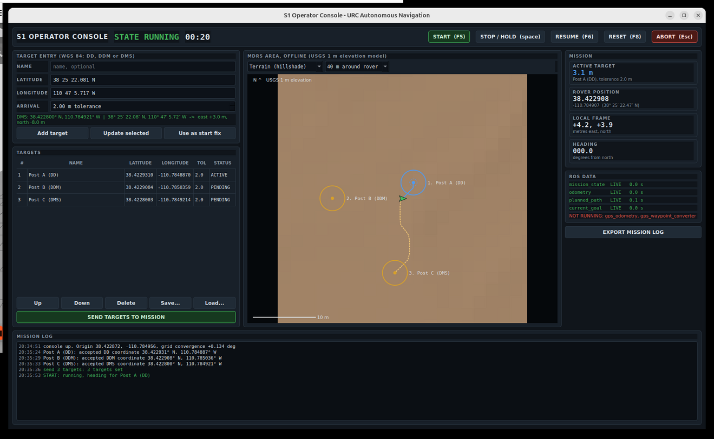
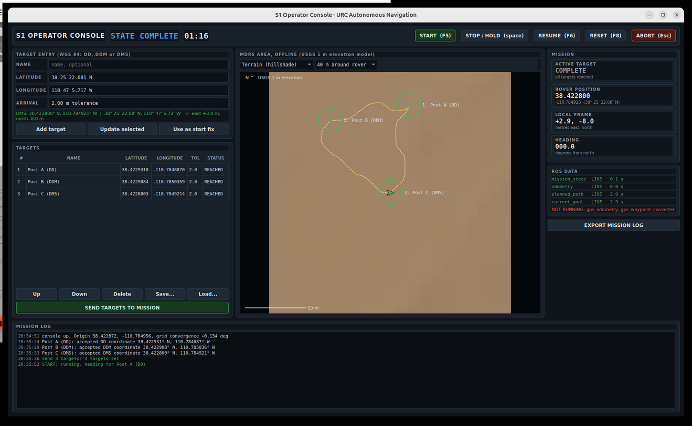

# loop-phase2: S1 operator console

UMD Loop Challenge Week, Phase II, challenge S1. The operator half of the
team's navigation system: a PyQt command and control GUI that is a ROS 2
node, plus the mission manager behind it.

The rover, the planner and the controller are Matthew's
([Challenge_Week, branch phase2](https://github.com/MatthewChoulas/Challenge_Week/tree/phase2)).
This repository is the operator side and does not modify his: it talks to his
nodes over the topics he publishes, in the frames he defined.

[](media/demo.mp4)

[One minute of it running](media/demo.mp4): the map layers, coordinates in
three formats and one refused, a mission started and held and resumed, three
targets reached, the navigation stack going off the air, and the log exported.

## What it does

- Takes WGS 84 coordinates typed in **decimal degrees, degrees and decimal
  minutes, or degrees minutes seconds**, tells you which format it read, and
  refuses anything invalid with the reason.
- Converts between WGS 84 and the local ROS frame (REP 103, x east, y north)
  using the same geodesic method as `gps_odometry`, so the GUI and the
  navigation stack agree on where a target is.
- Sets the rover's start coordinate, which is what associates the supplied
  start with the spawn position.
- Shows an **offline** map of the MDRS area, 2 km square, built from the USGS
  1 m elevation model already in the navigation package. Two layers: hillshade
  terrain and slope, coloured up to the 30 degree limit the rover cannot climb.
- Draws the rover's position, heading, the path it has driven, the planner's
  current path, the targets with their arrival circles, and the active goal.
- Creates, edits, reorders, deletes, saves and loads target lists.
- Starts, holds, resumes, aborts and resets a mission, from buttons or the
  keyboard (F5, space, F6, Escape, F8).
- Says when ROS data is stale, missing or a node is not running.
- Logs every command, state change, target result and coordinate conversion,
  exportable as JSON and CSV.

## Run it

Build both repositories in one workspace:

```bash
cd ~/loop_ws/src
git clone https://github.com/MatthewChoulas/Challenge_Week.git   # branch phase2
git clone https://github.com/benmross/loop-phase2.git
cd ~/loop_ws
colcon build
source install/setup.bash
```

Terrain world (the Phase II world, with GPS and the elevation map):

```bash
ros2 launch s1_navigation terrain.launch.py follow_path:=true   # Matthew's half
ros2 launch s1_gui gui.launch.py                                # this half
```

Flat obstacle world (Phase I world, full navigation stack, no GPS chain):

```bash
ros2 launch s1_navigation simulation.launch.py
ros2 launch s1_gui gui.launch.py publish_local_waypoints:=true
```

`publish_local_waypoints` exists because the flat world does not run
`gps_waypoint_converter`, so nothing would turn degrees into metres. With it
on, the manager publishes the local `PoseArray` itself, in the same frame and
QoS the planner already subscribes to.

Tests, which need neither ROS nor a display:

```bash
python3 -m pytest s1_gui/test
```

## How the pieces fit

```
  operator
     |  services: set_targets, command, set_start, export_log
     v
  console (PyQt, ROS node)  <--- /s1_mission/state (latched)
     |                       <--- /model/robot/odometry, /planned_path, /current_goal
     v
  mission_manager  ---> /robot_gps_start_location   (NavSatFix)
                   ---> /gps_waypoints              (Float64MultiArray, degrees)
                        |
                        v
                   gps_waypoint_converter -> /waypoints -> astar_planner
                                                        -> path_controller -> rover
```

The console never publishes a rover topic. Every operator action is a service
call to the mission manager, and everything the console shows arrives on a
topic. Three reasons:

1. The challenge asks for separation between GUI, mission management and rover
   control, and this is where the line naturally falls.
2. The mission outlives the GUI. Close the console mid-mission and reopen it
   and it picks the mission straight back up, because the state is latched on
   `/s1_mission/state` and the manager never stopped running.
3. A service call is acknowledged. The operator finds out that a command was
   refused, and why, instead of watching a topic and guessing.

## Coordinates, in three frames

| Frame | What it is | Used for |
|---|---|---|
| WGS 84 geographic | latitude and longitude | what the rules give, what the operator types, what goes on the wire to `gps_waypoints` |
| Local ROS frame | metres east and north of the DEM centre, REP 103 | what the planner and controller drive in |
| UTM zone 12N (EPSG:26912) | the grid the USGS DEM is cut on | placing things on the offline map image |

Geographic to local uses `pyproj.Geod.inv` on the WGS 84 ellipsoid: the
geodesic from the origin gives an azimuth and a distance, and
`east = distance * sin(azimuth)`, `north = distance * cos(azimuth)`. That is
exactly what `gps_odometry` and `gps_waypoint_converter` do, on purpose. The
GUI logs its own conversion and compares it against what the converter
published on `/waypoints`, and warns if the two ever differ by more than half
a metre. So far they agree to the millimetre.

**The local frame is not the UTM grid.** UTM north is grid north, which at
MDRS is about 0.13 degrees off true north (the grid convergence, which the
console prints at startup). Over a kilometre that is a couple of metres. The
map therefore places things by converting geographic to UTM, and the rover is
commanded by converting geographic to the local geodesic frame, and the two
are never assumed to be the same.

For drawing, the map builds one affine transform at startup from three points
taken properly through geodesic, geographic, UTM and pixels: the origin, one
metre east, and one metre north. That captures the rotation and scale exactly
and makes every later point a two multiply-add operation instead of a pyproj
call.

## QoS, and what happens when things go quiet

| Topic | QoS | Why |
|---|---|---|
| `/s1_mission/state` | reliable, transient local, depth 1 | the whole mission, including the target list. A console that starts late or restarts gets it on subscribe. |
| `/gps_waypoints`, `/robot_gps_start_location` | reliable, transient local, depth 1, repeated at 1 Hz | matches what his nodes publish and subscribe with. The repeat is for volatile subscribers that join late. |
| `/model/robot/odometry`, `/planned_path`, `/current_goal` | reliable, depth 5 | his publishers are reliable, and a subscriber must be no stricter than the publisher or it never connects. |

Every stream the console draws carries its own age. Under the stale threshold
values show normally; past it they turn amber; past the lost threshold the
values are replaced and the map is covered with ROVER POSITION NOT CURRENT.
The console also lists which expected nodes are not running at all, which is
the difference between "the rover has stopped talking" and "the planner was
never started".

The mission manager keeps running through all of this, because it is the
thing that knows what the mission is.

## Stopping the rover

There is no stop interface in the navigation stack yet, so a hold is enforced
from outside: an empty `/planned_path`, which makes `path_controller` stop
following, plus zero `cmd_vel` at 20 Hz, which is the same rate the controller
publishes at. It works, and it is an override rather than a handshake.

`integration/s1_navigation.patch` is the clean version for Matthew's side:

- `world_min` and `world_max` become parameters instead of the hard-coded
  +/-10 m, so the planner can be used on the 2 km terrain world at all;
- the planner and the converter accept a **new** target list instead of
  keeping the first one for the life of the launch, which is what re-tasking
  from a GUI needs;
- the converter accepts any number of latitude/longitude pairs rather than
  exactly three.

Everything in this repository works without that patch **except** re-tasking
after the first list, and terrain-world planning.

## Layout

```
s1_gui_msgs/          Target, MissionState; SetTargets, MissionCommand, SetStart, ExportLog
s1_gui/
  s1_gui/geodesy.py          the three formats and the three frames
  s1_gui/mission.py          targets, state machine, log, freshness rules (no ROS, no Qt)
  s1_gui/terrain.py          the offline map: elevation, hillshade, slope, geo-referencing
  s1_gui/mission_manager.py  the node that talks to the navigation stack
  s1_gui/console.py          the PyQt window
  s1_gui/widgets.py          map view, tiles, styling
  test/test_s1_gui.py        31 tests
integration/          the patch for s1_navigation, and how to apply it
```

## What is not done

- Targets are GNSS only, which is all the challenge asks for. There is no
  ArUco or object target type.
- Terrain-world navigation needs a costmap, and the terrain launch does not
  run one yet. The GUI drives the flat obstacle world end to end today.
- The hold override should become a proper interface on the navigation side.
- The map is one fixed 2 km square. Panning and zooming beyond the three
  preset views is not implemented.

## Verified

A mission driven entirely through the GUI on the flat obstacle world, with
Matthew's planner and controller doing the driving:

1. `38 75.0 N` typed as a latitude, refused: "75.0 minutes is not a minute value".
2. Three targets entered, one per format: `38.42293096 / -110.78488702` (DD),
   `38 25.374506 N / 110 47.102153 W` (DDM), `38 25 22.081 N / 110 47 5.717 W`
   (DMS). The console reported which format it read for each.
3. Sent to the mission manager, which converted them and published them.
   The conversions agreed with `gps_waypoint_converter` to the millimetre.
4. Started with F5, held mid-drive with the space bar (rover stopped), resumed
   with F6.
5. All three reached autonomously, around the world's obstacles, in about
   five minutes of simulated time, ending in STATE COMPLETE.
6. Log exported: `docs/sample-mission-log.json` is a real export from that run,
   with every command, conversion and arrival in it.



The failure paths were exercised too: a target beyond the planner's world
limit is warned about when it is sent, and a target the planner produces no
path to for fifteen seconds is marked UNREACHABLE and the mission moves on,
rather than leaving the operator watching a rover that is not moving.

31 unit tests cover the coordinate formats and their rejections, the three
frames and their round trips, the grid convergence, the mission state machine,
target files and the freshness thresholds.
